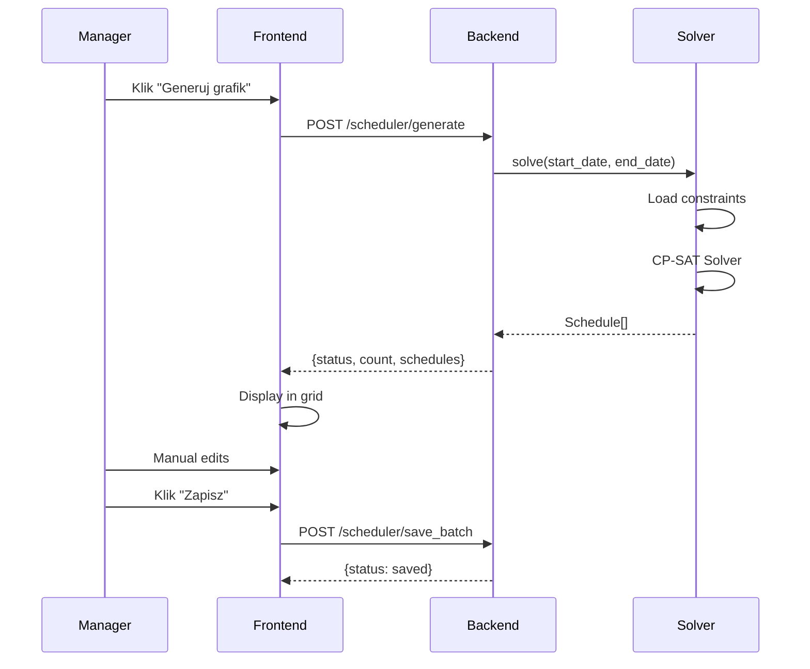

# Architektura Systemu

## Diagram Komponentów

```
┌─────────────────────────────────────────────────────────────┐
│                      FRONTEND (Flutter Web)                  │
├─────────────────────────────────────────────────────────────┤
│  ┌─────────────┐  ┌─────────────┐  ┌─────────────────────┐  │
│  │ Login/Reg   │  │ Manager UI  │  │ Employee Dashboard  │  │
│  └─────────────┘  └─────────────┘  └─────────────────────┘  │
│                          │                                   │
│               ┌──────────┴──────────┐                       │
│               │  ApiService (Dio)   │                       │
│               └──────────┬──────────┘                       │
└──────────────────────────┼──────────────────────────────────┘
                           │ HTTP/REST
┌──────────────────────────┼──────────────────────────────────┐
│                      BACKEND (FastAPI)                       │
├──────────────────────────┼──────────────────────────────────┤
│               ┌──────────┴──────────┐                       │
│               │    Routers Layer    │                       │
│               │  auth │ manager │   │                       │
│               │  scheduler│employee │                       │
│               └──────────┬──────────┘                       │
│                          │                                   │
│  ┌───────────────────────┼───────────────────────────────┐  │
│  │              Services Layer                            │  │
│  │  ┌─────────────────────────────────────────────────┐  │  │
│  │  │           SolverService (OR-Tools)               │  │  │
│  │  │  - Constraint Programming                        │  │  │
│  │  │  - Employee-Shift-Role Assignment               │  │  │
│  │  └─────────────────────────────────────────────────┘  │  │
│  └───────────────────────┬───────────────────────────────┘  │
│                          │                                   │
│               ┌──────────┴──────────┐                       │
│               │   SQLModel (ORM)    │                       │
│               └──────────┬──────────┘                       │
└──────────────────────────┼──────────────────────────────────┘
                           │
                   ┌───────┴───────┐
                   │   SQLite DB   │
                   └───────────────┘
```

## Modele Danych

| Model | Opis | Relacje |
|-------|------|---------|
| `User` | Użytkownik systemu | → JobRoles (M:N), → Schedules |
| `JobRole` | Stanowisko (Barista, Kucharz) | → Users (M:N) |
| `ShiftDefinition` | Definicja zmiany (8:00-16:00) | - |
| `Schedule` | Przypisanie: kto, kiedy, gdzie | → User, → Shift, → Role |
| `Availability` | Dostępność pracownika | → User, → Shift |
| `StaffingRequirement` | Wymagania (3 baristów rano) | → Shift, → Role |
| `RestaurantConfig` | Konfiguracja lokalu | Singleton |

## Przepływ Generowania Grafiku



## Bezpieczeństwo

- **JWT Auth**: Tokeny ważne 60 min
- **Manager PIN**: Wymagany przy rejestracji managera (`1234`)
- **Role-Based Access**: Manager vs Employee permissions
- **CORS**: Skonfigurowany dla localhost (dev)

## Skalowanie (Produkcja)

```yaml
# docker-compose.yml
services:
  backend:
    replicas: 2
    
  frontend:
    # Statyczne pliki przez nginx
    
  nginx:
    # Load balancer + SSL termination
    
  postgres:
    # Zamiast SQLite
```
