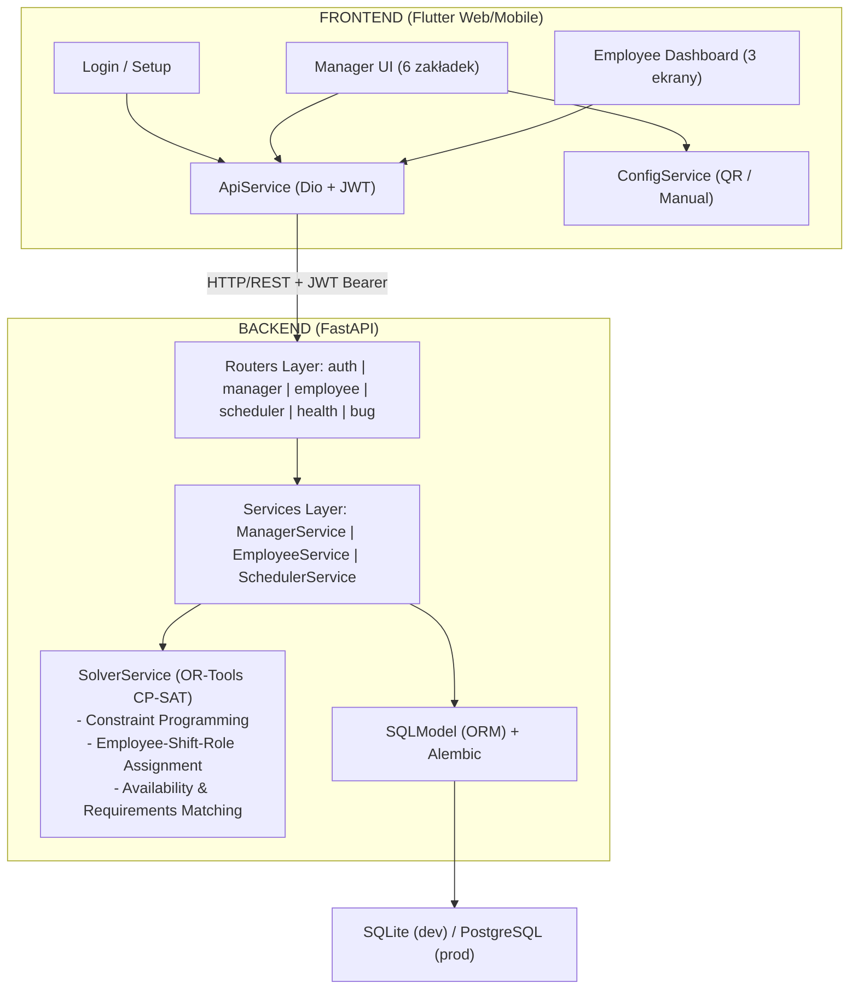
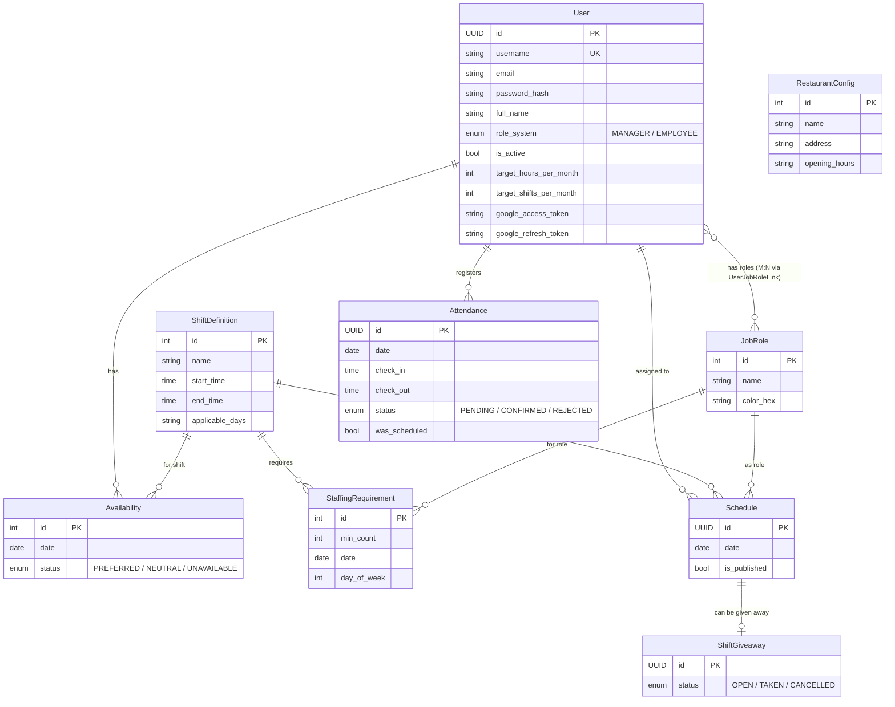
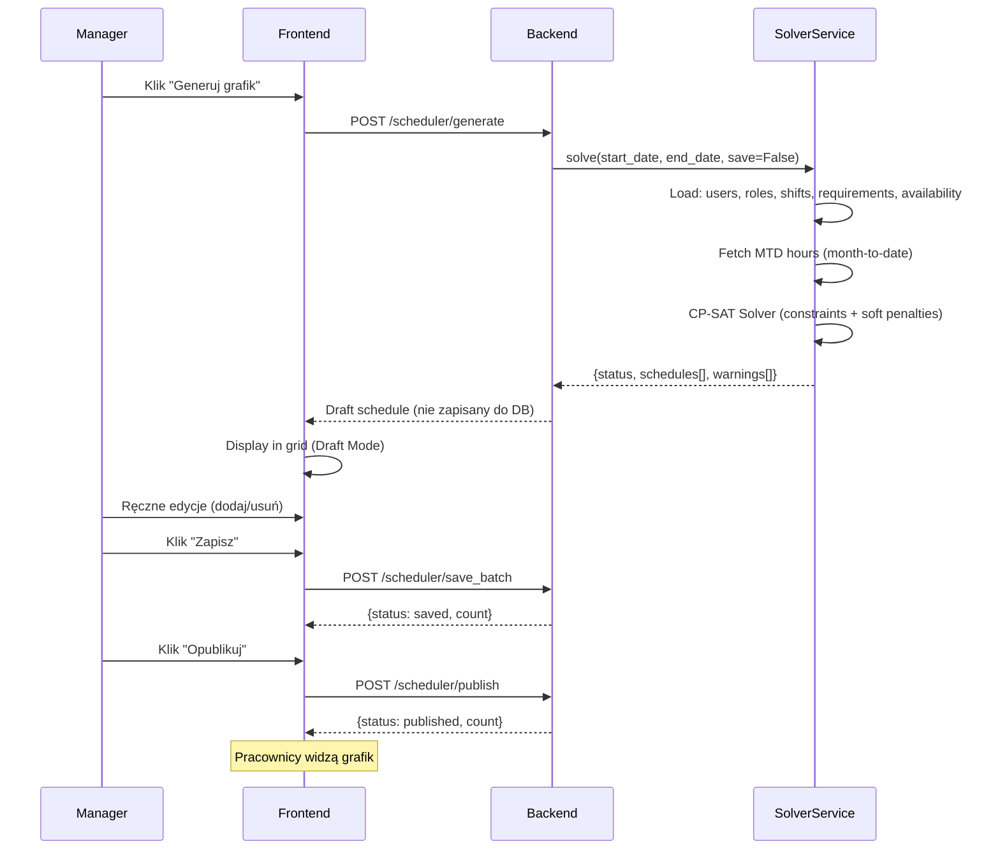
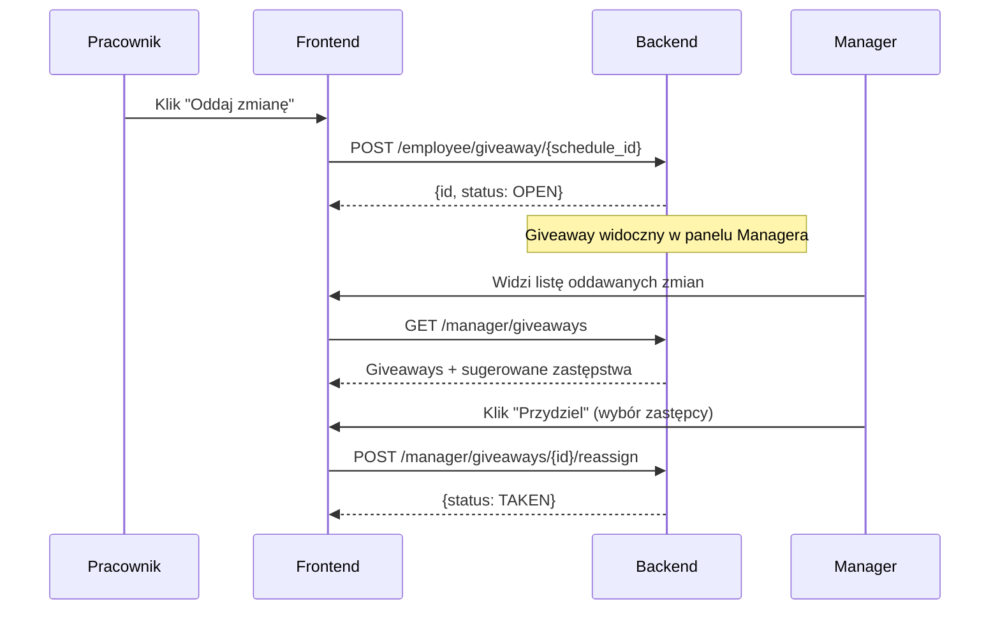
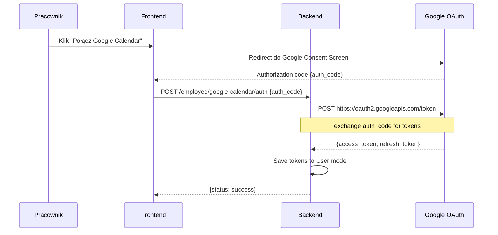

# Architektura Systemu PlannerV2

## Diagram Komponentów



## Modele Danych



## Warstwa Serwisów

| Serwis | Odpowiedzialność |
|--------|-----------------|
| `SolverService` | Generowanie grafiku (OR-Tools CP-SAT): ładowanie ograniczeń (dostępność, wymagania, cele godzinowe MTD), uruchomienie solvera, zwrócenie propozycji z ostrzeżeniami |
| `ManagerService` | Operacje managera: CRUD ról/zmian/users, statystyki, giveaway management, edycja imion (first/last → full_name), podgląd dostępności na zmianę |
| `EmployeeService` | Operacje pracownika: dostępność (+ status endpoint), grafik z listą współpracowników, obecność, integracja Google Calendar (OAuth 2.0 token exchange) |
| `SchedulerService` | Operacje na grafiku: zapis batch, listowanie, publikacja |

## Przepływ Generowania Grafiku



## Przepływ Oddawania Zmiany



## Przepływ Integracji Google Calendar



## Bezpieczeństwo

- **JWT Auth**: Tokeny ważne 60 min (bcrypt password hashing)
- **Manager PIN**: Konfigurowalny zmienną `MANAGER_REGISTRATION_PIN` (domyślnie `1234`)
- **Rejestracja wyłączona**: Konta tworzy wyłącznie Manager (`POST /manager/users`)
- **Aktywacja użytkowników**: Dezaktywowani użytkownicy nie mogą się zalogować (`is_active`)
- **Role-Based Access**: Manager vs Employee — middleware sprawdza `role_system`
- **CORS**: Skonfigurowany na `*` (dev), do zawężenia w produkcji
- **Google OAuth 2.0**: Klucze (`GOOGLE_CLIENT_ID`, `GOOGLE_CLIENT_SECRET`) przechowywane jako zmienne środowiskowe, nigdy w kodzie

## Wdrożenie (Produkcja)

```yaml
# docker-compose.yml
services:
  db:
    image: postgres:15
    # Persistent volume for data

  backend:
    build: ./backend
    # Alembic migrations run on startup
    # env: DATABASE_URL, MANAGER_REGISTRATION_PIN, GITHUB_TOKEN
    #       GOOGLE_CLIENT_ID, GOOGLE_CLIENT_SECRET, GOOGLE_REDIRECT_URI

  nginx:
    image: nginx:alpine
    ports: ["80:80"]
    # Reverse proxy: /api → backend, / → frontend static files
```

Pipeline CI/CD (Jenkins):
1. Backend tests (`pytest`)
2. Frontend analyze (`flutter analyze`)
3. Docker build & push
4. Deploy to dev/staging/prod
