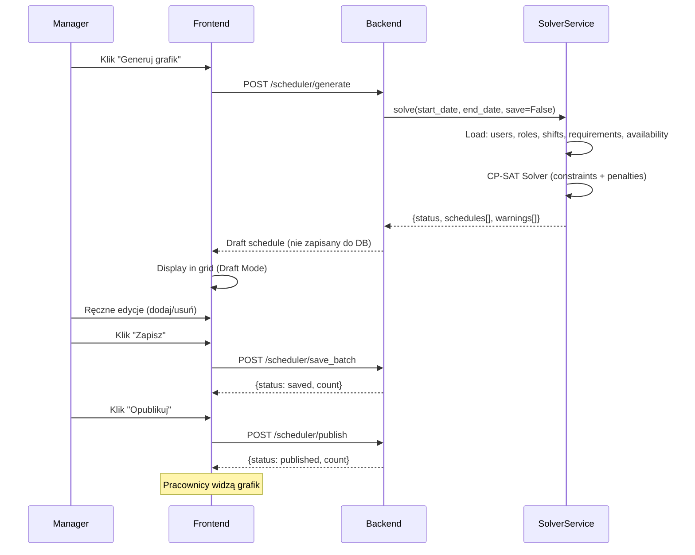
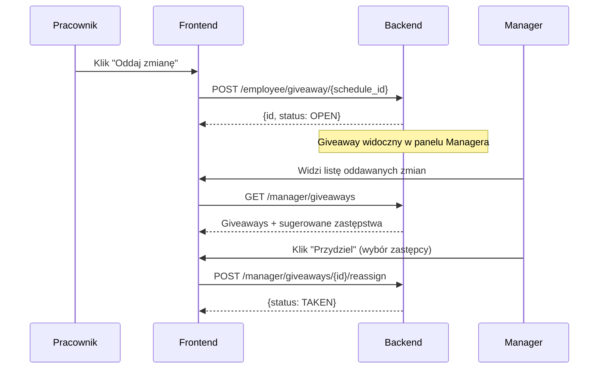

# Architektura Systemu

## Diagram Komponentów

```
┌─────────────────────────────────────────────────────────────────┐
│                      FRONTEND (Flutter Web/Mobile)               │
├─────────────────────────────────────────────────────────────────┤
│  ┌─────────────┐  ┌───────────────┐  ┌───────────────────────┐  │
│  │ Login/Setup  │  │ Manager UI    │  │ Employee Dashboard    │  │
│  │             │  │ (6 zakładek)  │  │ (3 ekrany)           │  │
│  └─────────────┘  └───────────────┘  └───────────────────────┘  │
│                          │                                       │
│          ┌───────────────┼───────────────┐                      │
│          │  ApiService    │ ConfigService │                      │
│          │  (Dio + JWT)  │ (QR/Manual)   │                      │
│          └───────────────┴───────────────┘                      │
└──────────────────────────┬──────────────────────────────────────┘
                           │ HTTP/REST + JWT Bearer
┌──────────────────────────┼──────────────────────────────────────┐
│                      BACKEND (FastAPI)                           │
├──────────────────────────┼──────────────────────────────────────┤
│          ┌───────────────┴───────────────┐                      │
│          │         Routers Layer          │                      │
│          │  auth │ manager │ employee    │                      │
│          │  scheduler │ health │ bug     │                      │
│          └───────────────┬───────────────┘                      │
│                          │                                       │
│  ┌───────────────────────┼───────────────────────────────────┐  │
│  │              Services Layer                                │  │
│  │  ManagerService │ EmployeeService │ SchedulerService      │  │
│  │  ┌─────────────────────────────────────────────────────┐  │  │
│  │  │           SolverService (OR-Tools CP-SAT)           │  │  │
│  │  │  - Constraint Programming                           │  │  │
│  │  │  - Employee-Shift-Role Assignment                   │  │  │
│  │  │  - Availability & Requirements Matching             │  │  │
│  │  └─────────────────────────────────────────────────────┘  │  │
│  └───────────────────────┬───────────────────────────────────┘  │
│                          │                                       │
│          ┌───────────────┴───────────────┐                      │
│          │   SQLModel (ORM) + Alembic    │                      │
│          └───────────────┬───────────────┘                      │
└──────────────────────────┼──────────────────────────────────────┘
                           │
              ┌────────────┴────────────┐
              │ SQLite (dev) / Postgres │
              └─────────────────────────┘
```

## Modele Danych

| Model | Opis | Kluczowe pola |
|-------|------|---------------|
| `User` | Użytkownik systemu | `username`, `role_system` (MANAGER/EMPLOYEE), `is_active`, `target_hours_per_month`, `target_shifts_per_month` |
| `JobRole` | Stanowisko (Barista, Kucharz) | `name`, `color_hex` |
| `UserJobRoleLink` | Tabela łącząca User ↔ JobRole (M:N) | `user_id`, `role_id` |
| `ShiftDefinition` | Definicja zmiany (8:00-16:00) | `name`, `start_time`, `end_time`, `applicable_days` |
| `Availability` | Dostępność pracownika | `user_id`, `date`, `shift_def_id`, `status` (PREFERRED/NEUTRAL/UNAVAILABLE) |
| `StaffingRequirement` | Wymagania kadrowe | `shift_def_id`, `role_id`, `min_count`, `date`/`day_of_week` |
| `Schedule` | Przypisanie: kto, kiedy, gdzie | `date`, `user_id`, `shift_def_id`, `role_id`, `is_published` |
| `RestaurantConfig` | Konfiguracja lokalu (singleton) | `name`, `address`, `opening_hours` |
| `Attendance` | Rejestracja czasu pracy | `user_id`, `date`, `check_in`, `check_out`, `status` (PENDING/CONFIRMED/REJECTED), `was_scheduled` |
| `ShiftGiveaway` | Oddawanie zmian | `schedule_id`, `offered_by`, `taken_by`, `status` (OPEN/TAKEN/CANCELLED) |

## Warstwa Serwisów

| Serwis | Odpowiedzialność |
|--------|-----------------|
| `SolverService` | Generowanie grafiku (OR-Tools CP-SAT): ładowanie ograniczeń, uruchomienie solvera, zwrócenie propozycji |
| `ManagerService` | Operacje managera: CRUD ról/zmian/users, statystyki, giveaway management |
| `EmployeeService` | Operacje pracownika: dostępność, grafik, obecność |
| `SchedulerService` | Operacje na grafiku: zapis batch, listowanie, publikacja |

## Przepływ Generowania Grafiku



## Przepływ Oddawania Zmiany



## Bezpieczeństwo

- **JWT Auth**: Tokeny ważne 60 min (bcrypt password hashing)
- **Manager PIN**: Konfigurowalny zmienną `MANAGER_REGISTRATION_PIN` (domyślnie `1234`)
- **Rejestracja wyłączona**: Konta tworzy wyłącznie Manager (`POST /manager/users`)
- **Aktywacja użytkowników**: Dezaktywowani użytkownicy nie mogą się zalogować (`is_active`)
- **Role-Based Access**: Manager vs Employee — middleware sprawdza `role_system`
- **CORS**: Skonfigurowany na `*` (dev), do zawężenia w produkcji

## Wdrożenie (Produkcja)

```yaml
# docker-compose.yml
services:
  db:
    image: postgres:15
    # Persistent volume for data

  backend:
    build: ./backend
    # Alembic migrations run on startup
    # env: DATABASE_URL, MANAGER_REGISTRATION_PIN, GITHUB_TOKEN

  nginx:
    image: nginx:alpine
    ports: ["80:80"]
    # Reverse proxy: /api → backend, / → frontend static files
```

Pipeline CI/CD (Jenkins):
1. Backend tests (`pytest`)
2. Frontend analyze (`flutter analyze`)
3. Docker build & push
4. Deploy to dev/staging/prod
