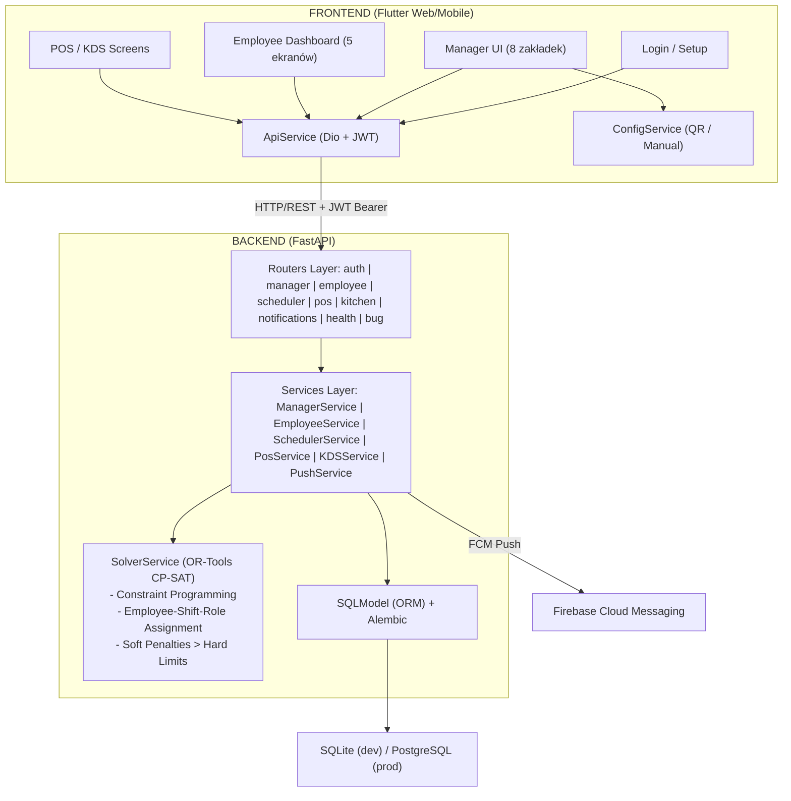
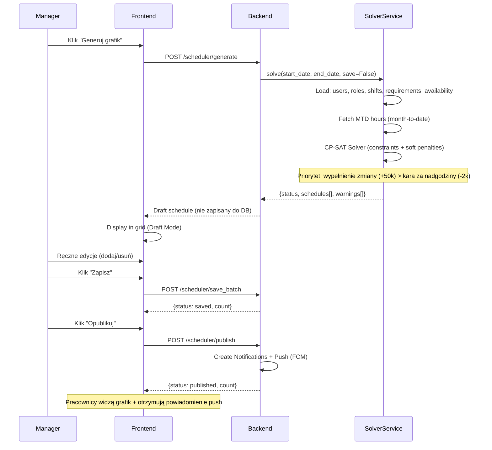
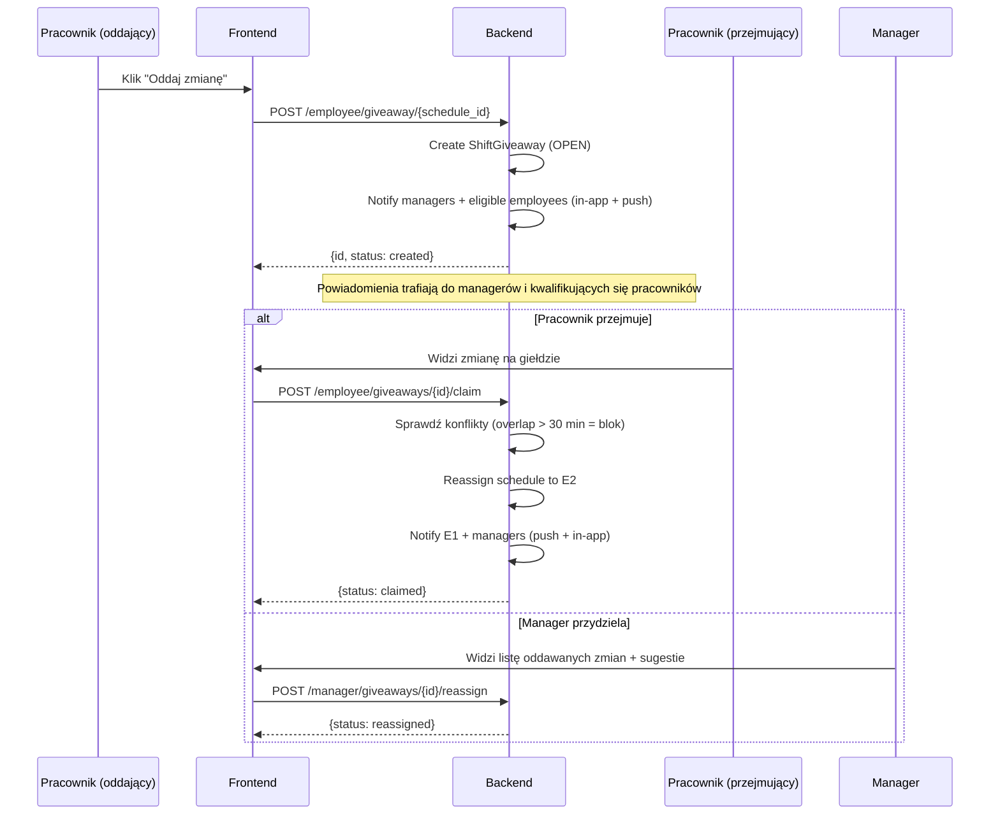
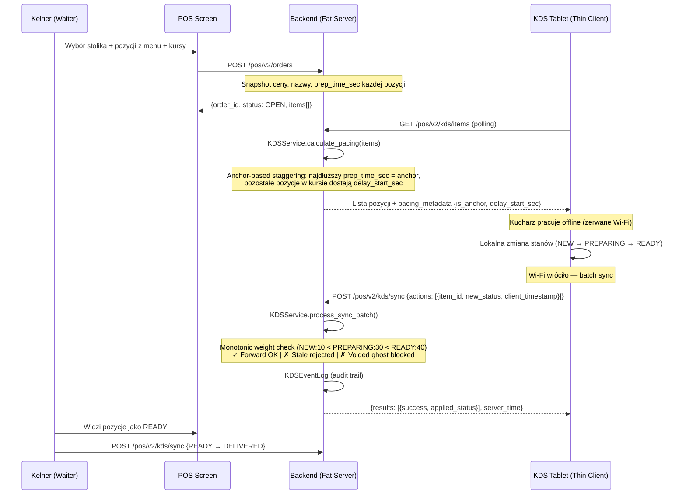

# Architektura Systemu PlannerV2

## Diagram Komponentów


```mermaid
graph TD
    subgraph FRONTEND["FRONTEND (Flutter Web/Mobile)"]
        direction TB
        LOGIN["Login / Setup"]
        MANAGER_UI["Manager UI (8 zakładek)"]
        EMPLOYEE_UI["Employee Dashboard (5 ekranów)"]
        POS_UI["POS / KDS Screens"]
        API_SVC["ApiService (Dio + JWT)"]
        CONFIG_SVC["ConfigService (QR / Manual)"]

        LOGIN --> API_SVC
        MANAGER_UI --> API_SVC
        EMPLOYEE_UI --> API_SVC
        POS_UI --> API_SVC
        MANAGER_UI --> CONFIG_SVC
    end

    API_SVC -- "HTTP/REST + JWT Bearer" --> ROUTERS

    subgraph BACKEND["BACKEND (FastAPI)"]
        direction TB
        ROUTERS["Routers Layer: auth | manager | employee | scheduler | pos | kitchen | notifications | health | bug"]
        SERVICES["Services Layer: ManagerService | EmployeeService | SchedulerService | PosService | KDSService | PushService"]
        SOLVER["SolverService (OR-Tools CP-SAT)\n- Constraint Programming\n- Employee-Shift-Role Assignment\n- Soft Penalties > Hard Limits"]
        ORM["SQLModel (ORM) + Alembic"]

        ROUTERS --> SERVICES
        SERVICES --> SOLVER
        SERVICES --> ORM
    end

    SERVICES -- "FCM Push" --> FCM["Firebase Cloud Messaging"]
    ORM --> DB["SQLite (dev) / PostgreSQL (prod)"]
```

## Modele Danych


```mermaid
erDiagram
    User {
        UUID id PK
        string username UK
        string email
        string password_hash
        string full_name
        enum role_system "MANAGER / EMPLOYEE"
        bool is_active
        int target_hours_per_month
        int target_shifts_per_month
        string encrypted_google_access_token
        string encrypted_google_refresh_token
        datetime created_at
    }

    JobRole {
        int id PK
        string name
        string color_hex
    }

    ShiftDefinition {
        int id PK
        string name
        time start_time
        time end_time
    }

    ShiftDefinitionDayLink {
        int shift_def_id FK
        int day_of_week "0=Mon 6=Sun"
    }

    Availability {
        UUID id PK
        UUID user_id FK
        date date
        int shift_def_id FK
        enum status "AVAILABLE / UNAVAILABLE"
    }

    StaffingRequirement {
        UUID id PK
        int shift_def_id FK
        int role_id FK
        int min_count
        date date "nullable - specific date"
        int day_of_week "nullable - global rule"
    }

    Schedule {
        UUID id PK
        date date
        int shift_def_id FK
        UUID user_id FK
        int role_id FK
        bool is_published
    }

    Attendance {
        UUID id PK
        UUID user_id FK
        date date
        time check_in
        time check_out
        bool was_scheduled
        enum status "PENDING / CONFIRMED / REJECTED"
        UUID schedule_id FK
    }

    ShiftGiveaway {
        UUID id PK
        UUID schedule_id FK
        UUID offered_by FK
        UUID taken_by FK
        enum status "OPEN / TAKEN / CANCELLED"
    }

    LeaveRequest {
        UUID id PK
        UUID user_id FK
        date start_date
        date end_date
        string reason
        enum status "PENDING / APPROVED / REJECTED / CANCELLED"
        UUID reviewed_by FK
    }

    Notification {
        UUID id PK
        UUID user_id FK
        string title
        string body
        bool is_read
        datetime created_at
    }

    UserDevice {
        UUID id PK
        UUID user_id FK
        string fcm_token UK
        datetime last_active
    }

    RestaurantConfig {
        int id PK
        string name
        string address
    }

    RestaurantOpeningHour {
        int id PK
        int config_id FK
        int day_of_week
        time open_time
        time close_time
    }

    TableZone {
        UUID id PK
        string name
        int sort_order
        bool is_active
    }

    PosTable {
        UUID id PK
        string name
        UUID zone_id FK
        int seats
        enum status "FREE / OCCUPIED / BILL_PRINTED / DIRTY"
    }

    Category {
        int id PK
        string name UK
        string color_hex
        int sort_order
    }

    MenuItem {
        UUID id PK
        string name
        float price
        int category_id FK
        int prep_time_sec "KDS Pacing"
        float tax_rate
        bool kitchen_print
        bool bar_print
    }

    ModifierGroup {
        int id PK
        string name
        int min_select
        int max_select
    }

    Modifier {
        int id PK
        int group_id FK
        string name
        float price_override
    }

    Order {
        UUID id PK
        UUID table_id FK
        UUID waiter_id FK
        enum status "OPEN / SENT / PARTIALLY_PAID / PAID / CANCELLED"
        int guest_count
        float discount_pct
    }

    OrderItem {
        UUID id PK
        UUID order_id FK
        UUID menu_item_id FK
        int quantity
        float unit_price_snapshot
        string item_name_snapshot
        int prep_time_sec_snapshot
        int course
        enum kds_status "NEW / PREPARING / READY / DELIVERED / VOIDED"
        int document_version
    }

    Payment {
        UUID id PK
        UUID order_id FK
        enum method "CASH / CARD / VOUCHER / MOBILE"
        float amount
        float tip_amount
    }

    KDSEventLog {
        UUID id PK
        UUID order_item_id FK
        string action_type
        UUID actor_id FK
        string old_state
        string new_state
        bool is_undo
    }

    User ||--o{ Availability : "has"
    User ||--o{ Schedule : "assigned to"
    User ||--o{ Attendance : "registers"
    User ||--o{ LeaveRequest : "submits"
    User ||--o{ Notification : "receives"
    User ||--o{ UserDevice : "has devices"
    User }o--o{ JobRole : "has roles (M:N via UserJobRoleLink)"
    ShiftDefinition ||--o{ ShiftDefinitionDayLink : "applicable on"
    ShiftDefinition ||--o{ Availability : "for shift"
    ShiftDefinition ||--o{ Schedule : "uses"
    ShiftDefinition ||--o{ StaffingRequirement : "requires"
    JobRole ||--o{ StaffingRequirement : "for role"
    JobRole ||--o{ Schedule : "as role"
    Schedule ||--o| ShiftGiveaway : "can be given away"
    Schedule ||--o| Attendance : "linked to"
    RestaurantConfig ||--o{ RestaurantOpeningHour : "hours"
    TableZone ||--o{ PosTable : "contains"
    PosTable ||--o{ Order : "has orders"
    User ||--o{ Order : "waiter"
    Category ||--o{ MenuItem : "contains"
    MenuItem }o--o{ ModifierGroup : "M:N via MenuItemModifierGroup"
    ModifierGroup ||--o{ Modifier : "options"
    Order ||--o{ OrderItem : "line items"
    Order ||--o{ Payment : "payments"
    OrderItem ||--o{ KDSEventLog : "audit trail"
```

## Warstwa Serwisów

| Serwis | Odpowiedzialność |
|--------|-----------------|
| `SolverService` | Generowanie grafiku (OR-Tools CP-SAT): ładowanie ograniczeń (dostępność, wymagania, cele godzinowe MTD), soft penalties za nadgodziny, priorytet wypełniania zmian nad limitami |
| `ManagerService` | CRUD ról/zmian/users, statystyki, giveaway management, wymagania kadrowe, urlopy (approve/reject), dashboard, konfiguracja restauracji |
| `EmployeeService` | Dostępność (+ status endpoint), grafik z listą współpracowników, obecność, integracja Google Calendar (OAuth 2.0) |
| `SchedulerService` | Zapis batch, listowanie, publikacja grafiku z powiadomieniami push |
| `PosService` | CRUD stref/stołów/kategorii/menu/modyfikatorów, zarządzanie zamówieniami i płatnościami, snapshotowanie cen |
| `KDSService` | **Monotoniczny sync batch** (walidacja wag stanów, anti-ghosting, audit log), **Pacing Engine** (anchor-based course staggering, `delay_start_sec`) |
| `PushService` | Firebase Cloud Messaging — wysyłka powiadomień push na urządzenia mobilne, fallback na mock w dev |

## Przepływ Generowania Grafiku


```mermaid
sequenceDiagram
    participant M as Manager
    participant F as Frontend
    participant B as Backend
    participant S as SolverService

    M->>F: Klik "Generuj grafik"
    F->>B: POST /scheduler/generate
    B->>S: solve(start_date, end_date, save=False)
    S->>S: Load: users, roles, shifts, requirements, availability
    S->>S: Fetch MTD hours (month-to-date)
    S->>S: CP-SAT Solver (constraints + soft penalties)
    Note over S: Priorytet: wypełnienie zmiany (+50k) > kara za nadgodziny (-2k)
    S-->>B: {status, schedules[], warnings[]}
    B-->>F: Draft schedule (nie zapisany do DB)
    F->>F: Display in grid (Draft Mode)
    M->>F: Ręczne edycje (dodaj/usuń)
    M->>F: Klik "Zapisz"
    F->>B: POST /scheduler/save_batch
    B-->>F: {status: saved, count}
    M->>F: Klik "Opublikuj"
    F->>B: POST /scheduler/publish
    B->>B: Create Notifications + Push (FCM)
    B-->>F: {status: published, count}
    Note over F: Pracownicy widzą grafik + otrzymują powiadomienie push
```

## Przepływ Giełdy Zmian


```mermaid
sequenceDiagram
    participant E1 as Pracownik (oddający)
    participant F as Frontend
    participant B as Backend
    participant E2 as Pracownik (przejmujący)
    participant M as Manager

    E1->>F: Klik "Oddaj zmianę"
    F->>B: POST /employee/giveaway/{schedule_id}
    B->>B: Create ShiftGiveaway (OPEN)
    B->>B: Notify managers + eligible employees (in-app + push)
    B-->>F: {id, status: created}
    Note over B: Powiadomienia trafiają do managerów i kwalifikujących się pracowników

    alt Pracownik przejmuje
        E2->>F: Widzi zmianę na giełdzie
        F->>B: POST /employee/giveaways/{id}/claim
        B->>B: Sprawdź konflikty (overlap > 30 min = blok)
        B->>B: Reassign schedule to E2
        B->>B: Notify E1 + managers (push + in-app)
        B-->>F: {status: claimed}
    else Manager przydziela
        M->>F: Widzi listę oddawanych zmian + sugestie
        F->>B: POST /manager/giveaways/{id}/reassign
        B-->>F: {status: reassigned}
    end
```

## Przepływ Zamówienia POS v2 / KDS (Offline-First Sync)


```mermaid
sequenceDiagram
    participant W as Kelner (Waiter)
    participant POS as POS Screen
    participant B as Backend (Fat Server)
    participant KDS as KDS Tablet (Thin Client)

    W->>POS: Wybór stolika + pozycji z menu + kursy
    POS->>B: POST /pos/v2/orders
    Note over B: Snapshot ceny, nazwy, prep_time_sec każdej pozycji
    B-->>POS: {order_id, status: OPEN, items[]}

    KDS->>B: GET /pos/v2/kds/items (polling)
    B->>B: KDSService.calculate_pacing(items)
    Note over B: Anchor-based staggering: najdłuższy prep_time_sec = anchor,<br/>pozostałe pozycje w kursie dostają delay_start_sec
    B-->>KDS: Lista pozycji + pacing_metadata {is_anchor, delay_start_sec}

    Note over KDS: Kucharz pracuje offline (zerwane Wi-Fi)
    KDS->>KDS: Lokalna zmiana stanów (NEW → PREPARING → READY)

    Note over KDS: Wi-Fi wróciło — batch sync
    KDS->>B: POST /pos/v2/kds/sync {actions: [{item_id, new_status, client_timestamp}]}
    B->>B: KDSService.process_sync_batch()
    Note over B: Monotonic weight check (NEW:10 < PREPARING:30 < READY:40)<br/>✓ Forward OK | ✗ Stale rejected | ✗ Voided ghost blocked
    B->>B: KDSEventLog (audit trail)
    B-->>KDS: {results: [{success, applied_status}], server_time}

    W->>POS: Widzi pozycje jako READY
    W->>B: POST /pos/v2/kds/sync {READY → DELIVERED}
```

## Powiadomienia Push (FCM)

System obsługuje powiadomienia push za pomocą Firebase Cloud Messaging:

| Zdarzenie | Odbiorcy | Kanał |
|-----------|----------|-------|
| Opublikowanie grafiku | Pracownicy z przypisaniami | In-app + Push |
| Nowa zmiana na giełdzie | Managerowie + kwalifikujący się pracownicy | In-app + Push |
| Zmiana przejęta z giełdy | Oddający pracownik + managerowie | In-app + Push |
| Nowy wniosek urlopowy | Managerowie | In-app + Push |
| Zatwierdzenie/odrzucenie urlopu | Wnioskujący pracownik | In-app + Push |

## Bezpieczeństwo

- **JWT Auth**: Tokeny ważne 60 min (pbkdf2_sha256 password hashing)
- **Manager PIN**: Konfigurowalny zmienną `MANAGER_REGISTRATION_PIN` (domyślnie `1234`)
- **Rejestracja wyłączona**: Konta tworzy wyłącznie Manager (`POST /manager/users`)
- **Aktywacja użytkowników**: Dezaktywowani użytkownicy nie mogą się zalogować (`is_active`)
- **Role-Based Access**: Manager vs Employee — middleware sprawdza `role_system`
- **Encrypted Tokens**: Tokeny Google (access + refresh) szyfrowane Fernetem (`ENCRYPTION_KEY`)
- **CORS**: Skonfigurowany na `*` (dev), do zawężenia w produkcji
- **Google OAuth 2.0**: Klucze przechowywane jako zmienne środowiskowe

## Wdrożenie (Produkcja)

```yaml
# docker-compose.yml
services:
  db:
    image: postgres:15
    # Persistent volume for data

  backend:
    build: ./backend
    # Alembic migrations run on startup
    # env: DATABASE_URL, SECRET_KEY, MANAGER_REGISTRATION_PIN,
    #       ENCRYPTION_KEY, GOOGLE_CLIENT_ID, GOOGLE_CLIENT_SECRET,
    #       GOOGLE_APPLICATION_CREDENTIALS, GITHUB_TOKEN, GITHUB_REPO

  nginx:
    image: nginx:alpine
    ports: ["80:80"]
    # Reverse proxy: /api → backend, / → frontend static files
```

Pipeline CI/CD (Jenkins):
1. Backend tests (`pytest`)
2. Frontend analyze (`flutter analyze`)
3. Docker build & push
4. Blue-Green deployment (DEV: auto z `main`, PROD: auto z tagów)
