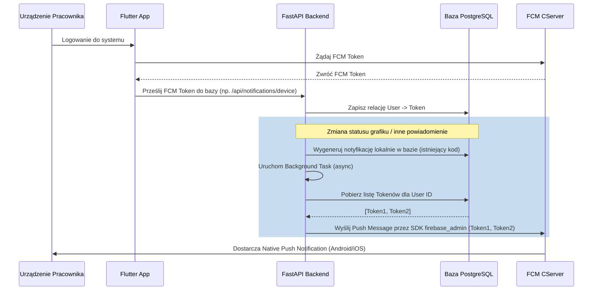

# FCM Push Notifications Architecture Plan

Aby wdrożyć powiadomienia Push na platformy mobilne (Android/iOS) i webowe dla aplikacji PlannerV2, w przyszłości należy zainicjować integrację z usługą **Firebase Cloud Messaging (FCM)**. Powiadomienia w aplikacji aktualnie opierają się na bazie danych i zapytaniach HTTP wywoływanych przez interfejs (dzwoneczek), jednak system zaprojektowano w taki sposób, aby był otwarty na rozbudowę o notyfikacje wypychane.

## Architektura i Przepływ

1. **Gromadzenie tokenów FCM (Rejestracja urządzeń)**
   - W warstwie Frontendowej (Flutter) należy zainstalować pakiet `firebase_messaging`.
   - Podczas logowania po pomyślnym autoryzowaniu (lub starcie aplikacji, gdzie użytkownik jest już zalogowany) aplikacja zapyta system o prawa do powiadomień.
   - Po nadaniu uprawnień wstrzyknięty zostanie kod pobrania tokenu rejestracji urządzenia (FCM Token).
   - Ten token należy przesłać pod nowy zasób w backendzie np. `POST /api/notifications/devices`.

2. **Składowanie tokenów po stronie Backendowej**
   - Dodanie nowej tabeli na backendzie (np. `UserDeviceToken` lub `FCMToken`), powiązanej relacją z modelem `User`. Z racji tego, że użytkownik może obsługiwać system równolegle z aplikacji na telefonie i przeglądarki, powiązanie powinno być 1-wiele.

3. **Inicjowanie powiadomień Push**
   - Po każdej akcji generującej nową notyfikację (np. dodanie dyżuru, zatwierdzenie ewidencji), kod aplikacji w `backend/routers` i `backend/services` dodaje standardowe powiadomienie rekordu do tabeli bazy danych środowiska (PostgreSQL).
   - Należy zaimplementować tzw. `Background Tasks` (korzystając z wbudowanych FastApi `BackgroundTasks` lub rozbudowanego narzędzia do kolejkowania jak np. `Celery/Redis`), który przetwarza utworzony wniosek wysłania.
   - Zadanie w tle (Background Task) pobierze wszystkie aktywne tokeny przypisane do danego `user_id` odbierającego i wykorzystując zestaw bibliotek Pythona podpiętych pod Firebase (`firebase-admin`) użyje integracji FCM Admin SDK do wywołania wysyłki wiadomości Push pod te tokeny.

## Wymagania wstępne i potrzebne zależności

- **Frontend (Flutter)**: Dodanie `firebase_messaging: ^X.X.X` w pliku `pubspec.yaml`. Utworzenie skryptów obsługi `FirebaseMessaging.onMessage`, `FirebaseMessaging.onMessageOpenedApp` i `FirebaseMessaging.onBackgroundMessage`.
- **Backend (FastAPI)**: Uruchomienie `pip install firebase-admin`. W projekcie istnieje już obsługa `.env`, należy osadzić plik certyfikacki konta usługowego Firebase jako referencję lokalną z `.env` lub jako dane środowiskowych zmiennych do ładowania przy starcie. Powołanie tablicy `UserDevice` używając migracji `Alembic`.

## Schemat działania

## Podsumowanie bezpieczeństwa

- Tokeny powinny być stale odświeżane. Warto usuwać rekordy powiązań z urządzeniami, gdy logowanie wygaśnie (np. aplikacja odeśle wyjątek niebytu podczas logiki 401 Unauthorized), albo z API wejdzie request z akcji wylogowania użytkownika (Endpoint `POST /auth/logout` do usunięcia tokenu powiązanego z sesją).
- Obsługa środowisk - Użytkownik deweloperski może wymagać innego środowiska Firebase niż Produkcja albo rozróżnienia notyfikacji Topic'ami/Prefixami. W tym projekcie posiadamy oddzielną bazę na DEV i PROD wspieraną kontenerami przez Docker Compose i Jenkins - środowisko PROD w backendzie będzie wskazywać na produkcyjny plik certyfikatów Service account, a DEV może wskazywać na np. devowy projekt Firebase lub by w ogóle mockowany tak by deweloper nie tworzył masowo spamu na ekranie przy testach Jenkinsa.
